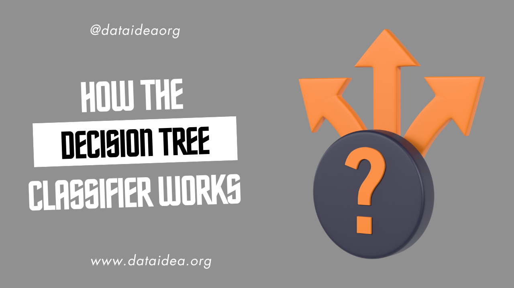

### Introduction

Decision tree classifiers are a type of supervised machine learning algorithm used for classification tasks. They are popular due to their simplicity and interpretability. This article will explain how decision tree classifiers work in simple terms, breaking down the key concepts and processes involved.

### What is a Decision Tree?

A decision tree is a flowchart-like structure where:

- Each internal node represents a "decision" based on the value of a feature.
- Each branch represents the outcome of a decision.
- Each leaf node represents a class label (the decision made after all features are considered).

### How Does a Decision Tree Classifier Work?

1. **Starting at the Root Node**:

   The process begins at the root node, which contains the entire dataset. The goal is to split this dataset into subsets that are more homogenous in terms of the target variable (class label).

2. **Choosing the Best Feature to Split On**:

   At each step, the algorithm selects the feature that best separates the classes. This is done using a metric like Gini impurity or Information Gain.

   - **Gini Impurity**: Measures the frequency at which any element of the dataset would be misclassified. It’s calculated as:
     $$
     Gini = 1 - \sum_{i=1}^{n} (p_i)^2
     $$
     where $p_i$ is the probability of an element being classified into a particular class.
   - **Information Gain**: Measures the reduction in entropy or impurity before and after a split. It’s calculated as:
     $$
     \text{Information Gain} = \text{Entropy(before split)} - \sum_{i=1}^{k} \frac{n_i}{n} \times \text{Entropy}(i)
     $$
     where $n_i$ is the number of instances in the $i$-th subset.

3. **Splitting the Node**:

   Once the best feature is chosen, the dataset is split into subsets based on the feature's values. Each subset forms a new node.

4. **Repeating the Process**:

   The algorithm recursively repeats the process for each new node, selecting the best feature to split on and creating further branches, until one of the stopping criteria is met:

   - All instances in a node belong to the same class.
   - No more features are left to split on.
   - A pre-defined maximum tree depth is reached.

5. **Making Predictions**:

   After the tree is built, it can be used to classify new instances. Starting from the root, the instance is evaluated against the decision rules at each node, following the branches until it reaches a leaf node, which gives the predicted class.

### Example of a Decision Tree Classifier

Consider a simple example where we want to classify whether a person will buy a computer based on their age and income.

#### Training Data

| Age   | Income | Buys Computer |
| ----- | ------ | ------------- |
| <30   | High   | No            |
| <30   | High   | No            |
| 31-40 | High   | Yes           |
| >40   | Medium | Yes           |
| >40   | Low    | No            |
| >40   | Low    | Yes           |
| 31-40 | Low    | Yes           |
| <30   | Medium | No            |
| <30   | Low    | Yes           |
| >40   | Medium | Yes           |
| <30   | Medium | Yes           |
| 31-40 | Medium | Yes           |

#### Building the Tree

1. **Root Node**:

   - Calculate the Gini impurity for the entire dataset.
   - Select the feature (Age or Income) that provides the best split based on Gini impurity or Information Gain.

2. **First Split**:

   - Suppose Age is selected. The data is split into three groups: <30, 31-40, and >40.

3. **Further Splits**:

   - For each age group, calculate the Gini impurity or Information Gain again and split further based on Income.

#### Resulting Tree

```
          [Age]
         /  |   \
      <30 31-40 >40
      /     |     \
  [Income]  Yes  [Income]
    /  \          /   \
  High Medium    Medium Low
   No   Yes       Yes   No
```

### Advantages of Decision Trees

- **Simple to Understand**: They are easy to visualize and interpret.
- **Non-linear Relationships**: Can capture non-linear relationships between features and the target variable.
- **Little Data Preparation**: Requires little data preprocessing compared to other algorithms.

### Disadvantages of Decision Trees

- **Overfitting**: Trees can become very complex and overfit the training data, especially if not pruned.
- **Unstable**: Small changes in the data can lead to different splits and thus different trees.

<p class=pb-1>
To be among the first to hear about future updates, simply enter your email below, follow us on <a href="https://x.com/dataideaorg"><i class="bi bi-twitter-x"></i>
 (formally Twitter)</a>, or subscribe to our <a href="https://www.youtube.com/@dataideaorg"><i class="bi bi-youtube"></i> YouTube channel</a>.
</p>
<iframe src="https://embeds.beehiiv.com/5fc7c425-9c7e-4e08-a514-ad6c22beee74?slim=true" data-test-id="beehiiv-embed" height="52" frameborder="0" scrolling="no" style="margin: 0; border-radius: 0px !important; background-color: transparent; width: 100%;" ></iframe>

<div class="p-3">
<h2>You may also like:</h2>
<a href="/posts/what-is-supervised-machine-learning/">
<h4>What is Supervised Machine Learning</h4>

</a>
</div>

<script async src="https://pagead2.googlesyndication.com/pagead/js/adsbygoogle.js?client=ca-pub-8076040302380238"
     crossorigin="anonymous"></script>
<!-- inline_horizontal -->

<ins class="adsbygoogle"
     style="display:block"
     data-ad-client="ca-pub-8076040302380238"
     data-ad-slot="9021194372"
     data-ad-format="auto"
     data-full-width-responsive="true"></ins>

<script>
     (adsbygoogle = window.adsbygoogle || []).push({});
</script>
