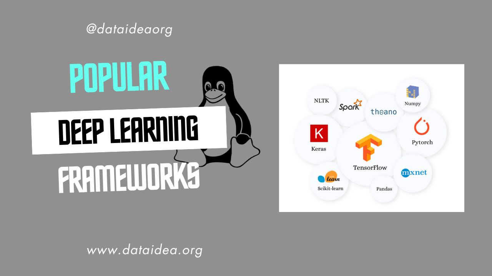

Deep learning, a subset of machine learning, has revolutionized various industries by enabling computers to mimic human intelligence. In this blog, we will explore some of the most popular deep learning frameworks that have shaped the AI landscape.

<!-- Newsletter -->

<strong>Don't Miss Any Updates!</strong>

Before we continue, we have a humble request, to be among the first to hear about future updates, simply enter your email below, follow us on <a href="https://x.com/dataideaorg"><i class="bi bi-twitter-x"></i>
 (formally Twitter)</a>, or subscribe to our <a href="https://www.youtube.com/@dataideaorg"><i class="bi bi-youtube"></i> YouTube channel</a>.

<iframe src="https://embeds.beehiiv.com/5fc7c425-9c7e-4e08-a514-ad6c22beee74?slim=true" data-test-id="beehiiv-embed" height="52" frameborder="0" scrolling="no" style="margin: 0; border-radius: 0px !important; background-color: transparent; width: 100%;" ></iframe>

## 1. TensorFlow

### Overview
Developed by the Google Brain team, TensorFlow is an open-source deep learning framework that has become a staple in the AI community. It offers a comprehensive ecosystem of tools, libraries, and community resources that facilitate the development and deployment of machine learning models.

### Key Features
- **Versatility**: TensorFlow supports various machine learning tasks, including neural networks, reinforcement learning, and even probabilistic models.
- **Flexibility**: With TensorFlow, you can build and train models using high-level APIs like Keras or dive deeper with its low-level APIs.
- **Scalability**: TensorFlow is designed to run on multiple CPUs and GPUs, making it suitable for both small-scale experiments and large-scale production deployments.
- **Community and Support**: TensorFlow boasts a large and active community, extensive documentation, and numerous tutorials, making it easier for newcomers to get started.

### Use Cases
TensorFlow has been used in a wide range of applications, from Google’s own products like Google Photos and Google Translate to research projects and commercial applications in healthcare, finance, and beyond.

## 2. PyTorch

### Overview
PyTorch, developed by Facebook’s AI Research lab, is another open-source deep learning framework that has gained immense popularity among researchers and practitioners. Known for its dynamic computation graph, PyTorch is particularly favored in the academic community for its flexibility and ease of use.

### Key Features
- **Dynamic Computation Graph**: PyTorch allows for the creation of dynamic graphs, which makes debugging and model development more intuitive and flexible.
- **Pythonic Nature**: PyTorch integrates seamlessly with Python, making it accessible to Python developers and allowing for easy integration with other Python libraries.
- **Strong Community**: PyTorch has a vibrant and growing community, with abundant resources, forums, and pre-trained models available.

### Use Cases
PyTorch is widely used in research settings due to its flexibility. It has also been adopted by companies for production-level AI solutions, including natural language processing, computer vision, and generative models.

## 3. Keras

### Overview
Keras is an open-source deep learning framework that provides a user-friendly API for building and training neural networks. Initially developed as a high-level API for TensorFlow, Keras now supports other backends like Theano and Microsoft Cognitive Toolkit (CNTK).

### Key Features
- **Ease of Use**: Keras emphasizes simplicity and user-friendliness, allowing for rapid prototyping and experimentation.
- **Modularity**: Keras is highly modular, enabling the easy combination of various neural network components.
- **Compatibility**: Keras can run on top of multiple backends, offering flexibility in terms of deployment.

### Use Cases
Keras is often used for quick prototyping and development of neural network models. Its simplicity makes it an excellent choice for beginners and educators, while its flexibility and power make it suitable for more advanced applications as well.

## 4. MXNet

### Overview
Apache MXNet is an open-source deep learning framework designed for efficiency and scalability. Backed by Amazon Web Services (AWS), MXNet is known for its performance in both training and inference.

### Key Features
- **Scalability**: MXNet can scale across multiple GPUs and distributed systems, making it ideal for large-scale projects.
- **Flexibility**: It supports both imperative and symbolic programming, catering to different development styles.
- **Integration with AWS**: MXNet is deeply integrated with AWS, providing robust support for deploying models on the cloud.

### Use Cases
MXNet is used in various large-scale AI applications, particularly those requiring high performance and scalability. Its integration with AWS makes it a preferred choice for cloud-based AI solutions.

## 5. Caffe

### Overview
Caffe, developed by the Berkeley Vision and Learning Center (BVLC), is a deep learning framework focused on speed and modularity. It is particularly well-suited for image classification and convolutional neural networks (CNNs).

### Key Features
- **Speed**: Caffe is optimized for performance, with a focus on processing speed and efficiency.
- **Modularity**: Caffe’s architecture allows for easy customization and extension.
- **Community Support**: Caffe has a strong community, with numerous pre-trained models and resources available.

### Use Cases
Caffe is widely used in academic research, as well as in industry applications involving computer vision, such as image classification, object detection, and segmentation.

## Conclusion

Choosing the right framework can significantly impact the success of your deep learning project. By understanding the strengths and unique features of each framework, you can make an informed decision that aligns with your goals and resources. Happy coding!

---

<h2>What's on your mind? Put it in the comments!</h2>
