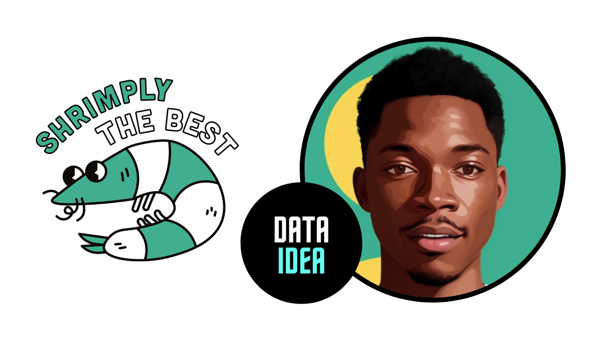

What are the best puns? Definitely the ones only a specific group of people will understand and enjoy. Especially in the era we’re living in, we need to feel like a family and share “inside” jokes with one another. So, let’s take a look at some of the best programming puns we came upon during the pre-summer times.

1. **Why do programmers like dark mode?**

   - Because light attracts bugs.

2. **I used to work as a programmer for autocorrect…**

   - Then they fried me for no raisin.

3. **What do NASA programmers do on the weekends?**

   - They hit the space bar.

4. **Why did the programmer quit his job?**

   - Because he didn’t get arrays.

5. **What was the SNES programmers’ favorite drink?**

   - Sprite

6. **What do programmers do when they’re hungry?**

   - They grab a byte.

7. **Why couldn’t the programmer dance to the song?**

   - Because he didn’t get the… algo-rhythm…

8. **What you call it when computer programmers make fun of each other?**

   - Cyber boolean…

9. **I am now a successful programmer…**

   - But back in the days I was a noobgrammer.

10. **Why do programmers always mix up Halloween and Christmas?**

    - Because Oct 31 equals Dec 25.

11. **Why did the programmer get a huge telephone bill?**

    - Because his program was CALLING a lot of subroutines.

12. **What do Spanish programmers code in?**

    - Sí ++

13. **Which way did the programmer go?**

    - He went data way!

14. **Why was the programmer always running into walls?**

    - He couldn’t see sharp.

15. **How programmers curse?**

    - Oh shift!

16. **Why do programmers make good politicians?**

    - Their goto is to switch statements.

17. **How did the programmer lose weight?**

    - He switched to a byte-sized diet.

18. **I almost bought a huge library out of old computer programming books…**

    - But the ascii price was way too high.

19. **What’s a Jedi’s favorite programming language?**
    - JabbaScript…

# Want to learn programming and become an expert?

If you’re serious about learning Programming and getting a job as a Developer, I
highly encourage you to enroll in my programming courses for Python, JavaScript, Data Science and Web Development.

Don’t waste your time following disconnected, outdated tutorials. I can teach you all that you need to kickstart your career.

Contact me at <a href="tel:+256771754118">+256771754118</a> or <a href="mailto:jumashafara@proton.me">jumashafara@proton.me</a>

<!-- Newsletter -->

<strong>Don't Miss Any Updates!</strong>

To be among the first to hear about future updates of the course materials, simply enter your email below, follow us on <a href="https://x.com/dataideaorg"><i class="bi bi-twitter-x"></i>
 (formally Twitter)</a>, or subscribe to our <a href="https://www.youtube.com/@dataideaorg"><i class="bi bi-youtube"></i> YouTube channel</a>.

<iframe src="https://embeds.beehiiv.com/5fc7c425-9c7e-4e08-a514-ad6c22beee74?slim=true" data-test-id="beehiiv-embed" height="52" frameborder="0" scrolling="no" style="margin: 0; border-radius: 0px !important; background-color: transparent; width: 100%;" ></iframe>

<!--Ad-->

<!-- inline_horizontal -->

<ins class="adsbygoogle"
     style="display:block"
     data-ad-client="ca-pub-8076040302380238"
     data-ad-slot="9021194372"
     data-ad-format="auto"
     data-full-width-responsive="true"></ins>

