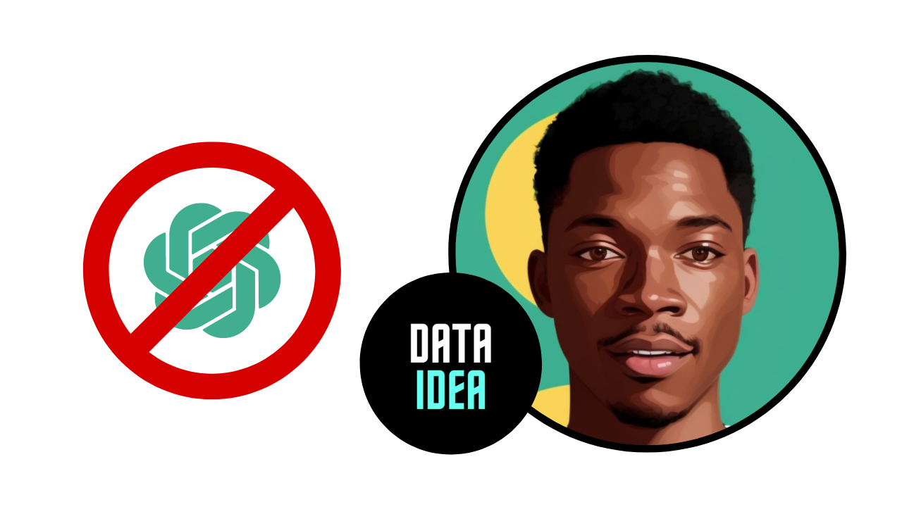

## Introduction

Artificial Intelligence (AI) has revolutionized the way we interact with technology, making many tasks more efficient and accessible. Among the AI applications, chatbots and virtual assistants have gained significant popularity, with ChatGPT being one of the leading models developed by OpenAI. While ChatGPT and similar AI tools offer numerous benefits, there are also several reasons to be cautious about their use. This blog aims to explore in detail why you might reconsider relying on ChatGPT, touching on aspects such as privacy concerns, ethical considerations, potential biases, reliability, and the broader societal implications of AI.

## Privacy Concerns

### Data Collection and Storage

One of the primary concerns with using ChatGPT is related to data privacy. When you interact with ChatGPT, your conversations are often recorded and stored. Although companies like OpenAI implement stringent data security measures, there is always a risk of data breaches. The data collected from users can potentially be accessed by unauthorized individuals, leading to privacy violations.

### Misuse of Personal Information

The personal information you share with ChatGPT could be misused. While AI developers claim that user data is anonymized and used solely to improve AI models, there is always a risk that this data could be sold to third parties or used for targeted advertising. This not only undermines your privacy but also raises ethical questions about the exploitation of user data.

### Lack of Transparency

Many users are unaware of how their data is being used when they interact with AI models like ChatGPT. The lack of transparency in data handling practices can lead to mistrust. Users should be informed about what data is being collected, how it is stored, and who has access to it. Without this transparency, it is difficult to trust that your data is being handled responsibly.

<ins class="adsbygoogle"
     style="display:block; text-align:center;"
     data-ad-layout="in-article"
     data-ad-format="fluid"
     data-ad-client="ca-pub-8076040302380238"
     data-ad-slot="8693891310"></ins>

## Ethical Considerations

### Manipulation and Misinformation

AI models like ChatGPT can be used to manipulate opinions and spread misinformation. The ability of AI to generate human-like text makes it a powerful tool for creating fake news, misleading articles, and deceptive social media posts. This can have serious consequences, including influencing elections, spreading conspiracy theories, and undermining public trust in information sources.

### Dehumanization of Interaction

Relying on AI for communication can lead to the dehumanization of interactions. While ChatGPT can simulate human conversation, it lacks the emotional intelligence and empathy that come from genuine human interaction. This can result in a diminished quality of communication, where the nuances of human emotions and connections are lost.

### Ethical Use in Sensitive Areas

The use of AI in sensitive areas such as mental health support, legal advice, and medical consultations raises ethical concerns. AI models may provide inaccurate or inappropriate advice, potentially causing harm to users. The reliance on AI in these critical areas should be approached with caution, ensuring that human oversight is always present to verify and validate the information provided by AI.

<ins class="adsbygoogle"
     style="display:block; text-align:center;"
     data-ad-layout="in-article"
     data-ad-format="fluid"
     data-ad-client="ca-pub-8076040302380238"
     data-ad-slot="8693891310"></ins>

## Potential Biases

### Inherent Biases in Training Data

AI models like ChatGPT are trained on vast amounts of data from the internet, which inevitably includes biased and prejudiced content. These biases can be reflected in the responses generated by the AI, perpetuating stereotypes and discriminatory attitudes. For instance, gender, racial, and cultural biases can be inadvertently reinforced through AI-generated text.

### Impact on Marginalized Communities

The biases present in AI models can disproportionately impact marginalized communities. AI-generated content that reflects societal biases can contribute to the marginalization and discrimination of these groups. It is essential to recognize and address these biases to ensure that AI technologies do not perpetuate inequality and injustice.

### Difficulty in Mitigating Biases

While efforts are being made to reduce biases in AI models, it is a challenging task. Biases are deeply ingrained in the data used to train these models, and completely eliminating them is nearly impossible. Continuous monitoring and updating of AI models are required to mitigate these biases, but the effectiveness of these measures is still a subject of ongoing research and debate.

<ins class="adsbygoogle"
     style="display:block; text-align:center;"
     data-ad-layout="in-article"
     data-ad-format="fluid"
     data-ad-client="ca-pub-8076040302380238"
     data-ad-slot="8693891310"></ins>

## Reliability and Accuracy

### Hallucinations and Errors

AI models like ChatGPT are prone to generating incorrect or nonsensical information, often referred to as "hallucinations." These errors can be misleading and potentially harmful, especially when users rely on the AI for accurate information. The inability to distinguish between correct and incorrect responses can undermine the reliability of AI-generated content.

### Lack of Accountability

When using AI models, it can be challenging to determine who is accountable for the information provided. Unlike human professionals who can be held responsible for their advice and actions, AI lacks accountability. This lack of accountability can lead to a scenario where misinformation is spread without any consequences for those responsible.

### Dependence on AI

Over-reliance on AI for information and decision-making can reduce critical thinking skills and the ability to independently verify information. Users may become dependent on AI-generated responses, leading to a decline in their analytical abilities and judgment. It is crucial to maintain a balance between using AI as a tool and exercising independent thought.

<ins class="adsbygoogle"
     style="display:block; text-align:center;"
     data-ad-layout="in-article"
     data-ad-format="fluid"
     data-ad-client="ca-pub-8076040302380238"
     data-ad-slot="8693891310"></ins>

## Broader Societal Implications

### Job Displacement

The increasing use of AI technologies, including ChatGPT, has the potential to displace jobs. As AI becomes more capable of performing tasks traditionally done by humans, there is a risk of job loss in various sectors. This can lead to economic instability and exacerbate issues related to unemployment and income inequality.

### Ethical Dilemmas in AI Development

The development and deployment of AI technologies pose significant ethical dilemmas. Decisions about what data to use, how to handle biases, and how to ensure the responsible use of AI are complex and multifaceted. The ethical challenges associated with AI development require careful consideration and the involvement of diverse stakeholders to navigate effectively.

### Impact on Human Creativity and Innovation

The reliance on AI for creative tasks, such as writing, music composition, and art, raises questions about the impact on human creativity and innovation. While AI can assist in these areas, there is a concern that it may stifle human creativity by providing easy solutions and reducing the incentive to develop original ideas. It is important to find a balance where AI complements human creativity rather than replacing it.

Don't miss out on any updates and developments! Subscribe to the DATAIDEA Newsletter it's easy and safe.

<iframe src="https://embeds.beehiiv.com/5fc7c425-9c7e-4e08-a514-ad6c22beee74?slim=true" data-test-id="beehiiv-embed" height="52" frameborder="0" scrolling="no" style="margin: 0; border-radius: 0px !important; background-color: transparent; width: 100%;" ></iframe>

## Conclusion

While ChatGPT and similar AI models offer numerous benefits, it is essential to be aware of the potential drawbacks and risks associated with their use. Privacy concerns, ethical considerations, potential biases, reliability issues, and broader societal implications are all important factors to consider. As we continue to integrate AI into our lives, it is crucial to approach its use with caution, ensuring that we prioritize ethical practices, transparency, and human oversight to mitigate the risks and maximize the benefits.
