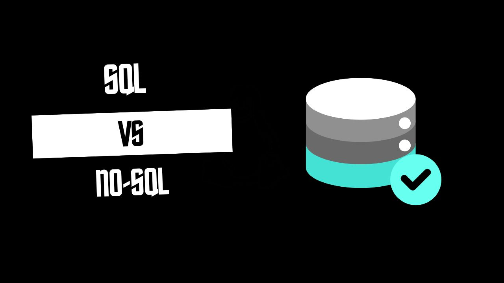

When working on a data-driven project, one of the crucial decisions I often face is choosing between SQL and NoSQL databases. Both have their strengths and weaknesses, and the right choice depends on the specific requirements of the project. Here's a brief overview of the key differences, uses, advantages, and disadvantages of SQL and NoSQL databases.

## 1. Understanding SQL and NoSQL

- **SQL (Structured Query Language)** databases are relational databases that use structured query language to define and manipulate data. They are table-based and enforce a predefined schema, ensuring data integrity and consistency.

- **NoSQL (Not Only SQL)** databases are non-relational and can handle a variety of data models, including document, key-value, graph, and column-family. They are more flexible, allowing for dynamic schemas and scalability.

## 2. Differences Between SQL and NoSQL

| Aspect             | SQL Databases                                                  | NoSQL Databases                                  |
| ------------------ | -------------------------------------------------------------- | ------------------------------------------------ |
| **Data Model**     | Relational (tables with rows and columns)                      | Non-relational (documents, key-value, etc.)      |
| **Schema**         | Fixed, predefined schema                                       | Dynamic, flexible schema                         |
| **Query Language** | SQL                                                            | Varies (e.g., MongoDB uses JSON-like queries)    |
| **Transactions**   | ACID-compliant (Atomicity, Consistency, Isolation, Durability) | Often eventually consistent, but not always ACID |
| **Scalability**    | Vertical (adding more resources to a single server)            | Horizontal (adding more servers)                 |
| **Examples**       | MySQL, PostgreSQL, Oracle                                      | MongoDB, Cassandra, Redis                        |

<!-- Newsletter -->

<h4><i class="bi bi-info-circle-fill"></i> Don't Miss Any Updates!</h4>

Before we continue, I have a humble request, to be among the first to hear about future updates of the course materials, simply enter your email below, follow us on <a href="https://x.com/dataideaorg"><i class="bi bi-twitter-x"></i>
(formally Twitter)</a>, or subscribe to our <a href="https://www.youtube.com/@dataideaorg"><i class="bi bi-youtube"></i> YouTube channel</a>.

<iframe class="newsletter-frame" src="https://embeds.beehiiv.com/5fc7c425-9c7e-4e08-a514-ad6c22beee74?slim=true" data-test-id="beehiiv-embed" height="52" frameborder="0" scrolling="no">
</iframe>

## 3. Uses of SQL and NoSQL

- **SQL** is ideal for applications that require multi-row transactions, such as banking systems, enterprise applications, and e-commerce platforms where data integrity is paramount.

- **NoSQL** is perfect for handling large volumes of unstructured or semi-structured data, such as social media, big data analytics, real-time applications, and IoT where scalability and flexibility are crucial.

## 4. Advantages and Disadvantages

### SQL

| **SQL Advantages**                            | **SQL Disadvantages**                              |
| --------------------------------------------- | -------------------------------------------------- |
| Strong consistency and data integrity         | Less flexible due to rigid schema                  |
| Mature technology with extensive tools        | Can struggle with large-scale, distributed systems |
| ACID compliance ensures reliable transactions | Vertical scalability can become costly             |

### NoSQL

| **NoSQL Advantages**                          | **NoSQL Disadvantages**                       |
| --------------------------------------------- | --------------------------------------------- |
| Highly scalable and flexible                  | Weaker consistency, depending on the database |
| Handles large volumes of unstructured data    | Less mature with fewer standardized tools     |
| Schema-less design allows for rapid iteration | May require more complex data modeling        |

<!-- inline-square -->

<ins class="adsbygoogle"
     style="display:block"
     data-ad-client="ca-pub-8076040302380238"
     data-ad-slot="3564352555"
     data-ad-format="auto"
     data-full-width-responsive="true"></ins>

## 5. Which Should I Choose?

In my experience, the choice between SQL and NoSQL depends on the specific needs of the project:

- **Use SQL** if the project demands strong consistency, complex queries, and structured data with clear relationships.
- **Use NoSQL** if the project requires high scalability, flexibility, and the ability to handle large volumes of unstructured data.

Understanding the trade-offs helps me make an informed decision, ensuring that the database choice aligns with the project's goals and requirements.

<h2>What's on your mind? Put it in the comments!</h2>

