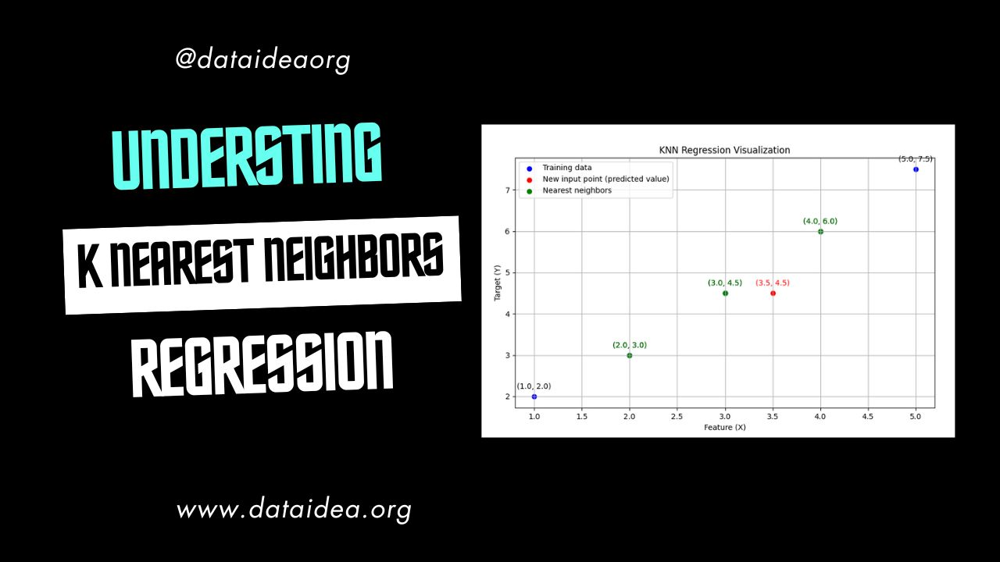
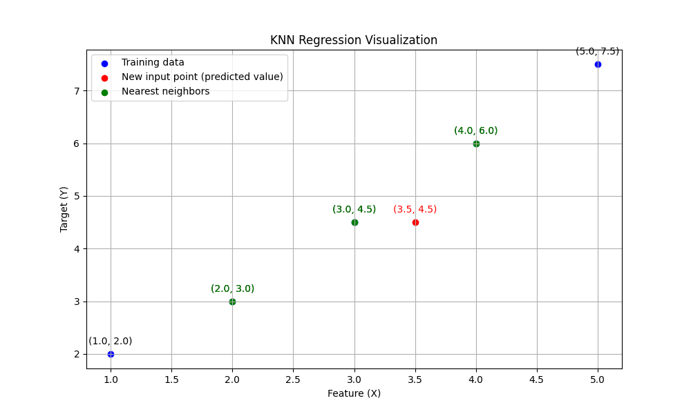

## Introduction to KNN Regression

K-Nearest Neighbors (KNN) regression is a type of instance-based learning algorithm used for regression problems. It makes predictions based on the $k$ most similar instances (neighbors) in the training dataset. The algorithm is non-parametric, meaning it makes predictions without assuming any underlying data distribution.

<!-- Newsletter -->

<strong>Don't Miss Any Updates!</strong>

To be among the first to hear about future updates of the course materials, simply enter your email below, follow us on <a href="https://x.com/dataideaorg"><i class="bi bi-twitter-x"></i>
 (formally Twitter)</a>, or subscribe to our <a href="https://www.youtube.com/@dataideaorg"><i class="bi bi-youtube"></i> YouTube channel</a>.

<iframe src="https://embeds.beehiiv.com/5fc7c425-9c7e-4e08-a514-ad6c22beee74?slim=true" data-test-id="beehiiv-embed" height="52" frameborder="0" scrolling="no" style="margin: 0; border-radius: 0px !important; background-color: transparent; width: 100%;" ></iframe>

## Key Concepts

1. **Distance Metric**: The method used to calculate the distance between instances. Common metrics include Euclidean, Manhattan, and Minkowski distances.
2. **k**: The number of neighbors to consider when making a prediction. Choosing the right $k$ is crucial for the algorithm's performance.
3. **Weighted KNN**: In some variants, closer neighbors have a higher influence on the prediction than more distant ones, often implemented by assigning weights inversely proportional to the distance.

## How KNN Regression Works

### Step-by-Step Process

1. **Load the Data**: Start with a dataset consisting of feature vectors and their corresponding target values.
2. **Choose the Number of Neighbors (k)**: Select the number of nearest neighbors to consider for making predictions.
3. **Distance Calculation**: For a new data point, calculate the distance between this point and all points in the training dataset.
4. **Find Nearest Neighbors**: Identify the $k$ points in the training data that are closest to the new point.
5. **Predict the Target Value**: Compute the average (or a weighted average) of the target values of the $k$ nearest neighbors.

### Example

Let's walk through an example with a simple dataset.

**Dataset**:

| Feature (X) | Target (Y) |
| ----------- | ---------- |
| 1.0         | 2.0        |
| 2.0         | 3.0        |
| 3.0         | 4.5        |
| 4.0         | 6.0        |
| 5.0         | 7.5        |

**New Point**: $X_{new} = 3.5$

1. **Choose $k$**: Let's select $k = 3$.
2. **Calculate Distances**:
   - Distance to (1.0, 2.0): $\sqrt{(3.5-1.0)^2} = 2.5$
   - Distance to (2.0, 3.0): $\sqrt{(3.5-2.0)^2} = 1.5$
   - Distance to (3.0, 4.5): $\sqrt{(3.5-3.0)^2} = 0.5$
   - Distance to (4.0, 6.0): $\sqrt{(3.5-4.0)^2} = 0.5$
   - Distance to (5.0, 7.5): $\sqrt{(3.5-5.0)^2} = 1.5$
3. **Find Nearest Neighbors**:
   - Neighbors: (3.0, 4.5), (4.0, 6.0), and (2.0, 3.0) (distances 0.5, 0.5, and 1.5 respectively)
4. **Predict the Target Value**:
   - Average the target values of the nearest neighbors: $\frac{4.5 + 6.0 + 3.0}{3} = \frac{13.5}{3} = 4.5$

So, the predicted target value for $X_{new} = 3.5$ is 4.5.

## Visualizing KNN Regression

Below is a visual representation of the KNN regression process:

- The blue points represent the training data.
- The red point is the new input for which we want to predict the target value.
- The green points are the nearest neighbors considered for the prediction.

### Advantages and Disadvantages

#### Advantages:

- **Simplicity**: Easy to understand and implement.
- **No Training Phase**: The algorithm stores the training dataset and makes predictions at runtime.

#### Disadvantages:

- **Computationally Intensive**: Requires computing the distance to all training points for each prediction, which can be slow for large datasets.
- **Choosing \( k \)**: Selecting the optimal \( k \) can be challenging and often requires cross-validation.
- **Curse of Dimensionality**: Performance can degrade in high-dimensional spaces as distances become less meaningful.

### Conclusion

KNN regression is a straightforward and intuitive algorithm for making predictions based on the similarity of data points. Despite its simplicity, it can be quite powerful, especially for smaller datasets. However, it can become computationally expensive for large datasets and high-dimensional data, and it requires careful selection of the number of neighbors \( k \).

By understanding and visualizing the KNN regression process, you can better appreciate its applications and limitations, allowing you to apply it effectively in your machine learning projects.

## What do you think? Put it in the comments below!

<!--Ad-->

<!-- inline_horizontal -->

<ins class="adsbygoogle"
     style="display:block"
     data-ad-client="ca-pub-8076040302380238"
     data-ad-slot="9021194372"
     data-ad-format="auto"
     data-full-width-responsive="true"></ins>

<!-- Newsletter -->

<strong>Don't Miss Any Updates!</strong>

To be among the first to hear about future updates of the course materials, simply enter your email below, follow us on <a href="https://x.com/dataideaorg"><i class="bi bi-twitter-x"></i>
 (formally Twitter)</a>, or subscribe to our <a href="https://www.youtube.com/@dataideaorg"><i class="bi bi-youtube"></i> YouTube channel</a>.

<iframe src="https://embeds.beehiiv.com/5fc7c425-9c7e-4e08-a514-ad6c22beee74?slim=true" data-test-id="beehiiv-embed" height="52" frameborder="0" scrolling="no" style="margin: 0; border-radius: 0px !important; background-color: transparent; width: 100%;" ></iframe>

<h2>You may also like:</h2>
<a href="/posts/what-is-supervised-machine-learning/">
<h4>How the Decision Tree Classifier Works</h4>

</a>

