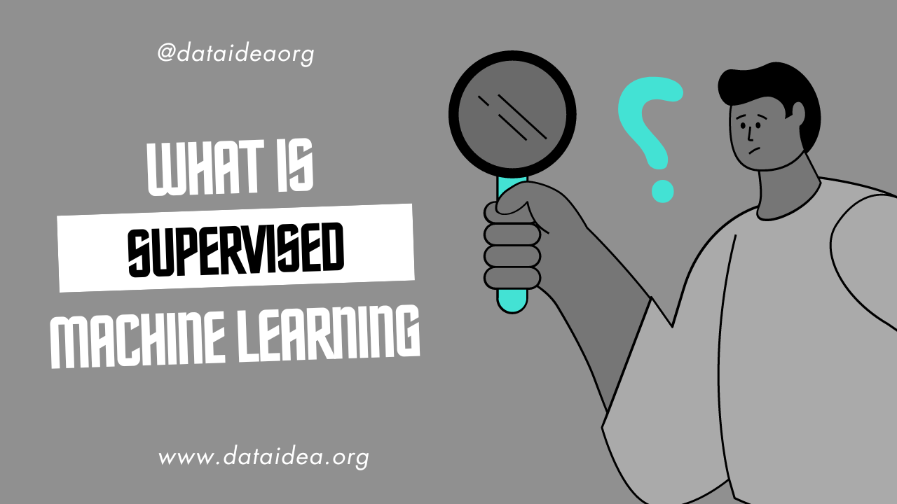

## Understanding Supervised Machine Learning

Supervised machine learning is a subfield of machine learning where an algorithm learns from labeled training data to make predictions or decisions without being explicitly programmed to perform the task. The process involves two primary phases: training and testing. Here, we'll delve into the details of how supervised learning works, using formulas and tables to illustrate key concepts.

### Key Concepts in Supervised Learning

1. **Labeled Data**: The foundational element in supervised learning is labeled data, which consists of input-output pairs. Each input (feature vector $\mathbf{x}$) has a corresponding output (label $y$). For instance, in a housing price prediction model, the features could include the size of the house, number of bedrooms, etc., and the label would be the price of the house.

2. **Training Phase**: During the training phase, the algorithm learns a mapping from inputs to outputs using the labeled dataset. This involves optimizing a model to minimize the difference between the predicted outputs and the actual outputs.

3. **Testing Phase**: After training, the model's performance is evaluated on a separate testing set, which was not seen during training. This helps assess the model's generalization ability to new, unseen data.

### Supervised Learning Algorithms

There are two main types of supervised learning tasks: regression and classification.

- **Regression**: Used when the output variable is continuous. Example: Predicting house prices.
- **Classification**: Used when the output variable is categorical. Example: Spam email detection.

### Mathematical Formulation

#### Regression

For regression tasks, a common algorithm is Linear Regression. The goal is to find the best-fitting line through the data points.

The model is defined as:
$$y = \mathbf{w}^T \mathbf{x} + b$$

where:
- $y$ is the predicted output.
- $\mathbf{x}$ is the feature vector.
- $\mathbf{w}$ is the weight vector.
- $b$ is the bias term.

The training process involves minimizing the loss function, typically the Mean Squared Error (MSE):
$$\text{MSE} = \frac{1}{n} \sum_{i=1}^n (y_i - \hat{y_i})^2$$

where:
- $n$ is the number of training examples.
- $y_i$ is the actual output for the $i$-th example.
- $\hat{y_i}$ is the predicted output for the $i$-th example.

#### Classification

For classification tasks, Logistic Regression is a commonly used algorithm. The model estimates the probability that a given input belongs to a certain class.

The logistic model is:
$$P(y=1|\mathbf{x}) = \sigma(\mathbf{w}^T \mathbf{x} + b)$$

where $\sigma$ is the sigmoid function:
$$\sigma(z) = \frac{1}{1 + e^{-z}}$$

The loss function for logistic regression is the Binary Cross-Entropy:
$$\text{BCE} = - \frac{1}{n} \sum_{i=1}^n \left[ y_i \log(\hat{y_i}) + (1 - y_i) \log(1 - \hat{y_i}) \right]$$

### Example: Housing Price Prediction

#### Training Data

| Size (sq ft) | Bedrooms | Price ($) |
|--------------|----------|-----------|
| 1500         | 3        | 300,000   |
| 1800         | 4        | 350,000   |
| 2000         | 4        | 400,000   |
| 2200         | 5        | 450,000   |

#### Linear Regression Model

Assume we have a feature vector $\mathbf{x} = [\text{Size, Bedrooms}]$ and we want to predict the price $y$.

1. Initialize weights $\mathbf{w}$ and bias $b$.
2. Use the training data to find the best $\mathbf{w}$ and $b$ that minimize the MSE.
3. Predict the price for a new house with size 2100 sq ft and 4 bedrooms.

### Example: Email Spam Detection

#### Training Data

| Email Content                           | Spam (1) / Not Spam (0) |
|-----------------------------------------|-------------------------|
| "Win a free vacation now!"              | 1                       |
| "Meeting at 10 AM tomorrow"             | 0                       |
| "Limited time offer, click now!"        | 1                       |
| "Your report is due by Friday"          | 0                       |

#### Logistic Regression Model

1. Convert email content to feature vectors (e.g., word counts, presence of certain keywords).
2. Initialize weights $\mathbf{w}$ and bias $b$.
3. Use the training data to find the best $\mathbf{w}$ and $b$ that minimize the BCE.
4. Predict whether a new email "Congratulations, you've won!" is spam.

To be among the first to hear about future updates, simply enter your email below, follow us on <a href="https://x.com/dataideaorg"><i class="bi bi-twitter-x"></i>
 (formally Twitter)</a>, or subscribe to our <a href="https://www.youtube.com/@dataideaorg"><i class="bi bi-youtube"></i> YouTube channel</a>.

<iframe src="https://embeds.beehiiv.com/5fc7c425-9c7e-4e08-a514-ad6c22beee74?slim=true" data-test-id="beehiiv-embed" height="52" frameborder="0" scrolling="no" style="margin: 0; border-radius: 0px !important; background-color: transparent; width: 100%;" ></iframe>

<h2>You may also like:</h2>
<a href="/posts/overview-of-machine-learning/">
<h4>Overview of Machine Learning</h4>

</a>

<!-- inline_horizontal -->
<ins class="adsbygoogle"
     style="display:block"
     data-ad-client="ca-pub-8076040302380238"
     data-ad-slot="9021194372"
     data-ad-format="auto"
     data-full-width-responsive="true"></ins>
